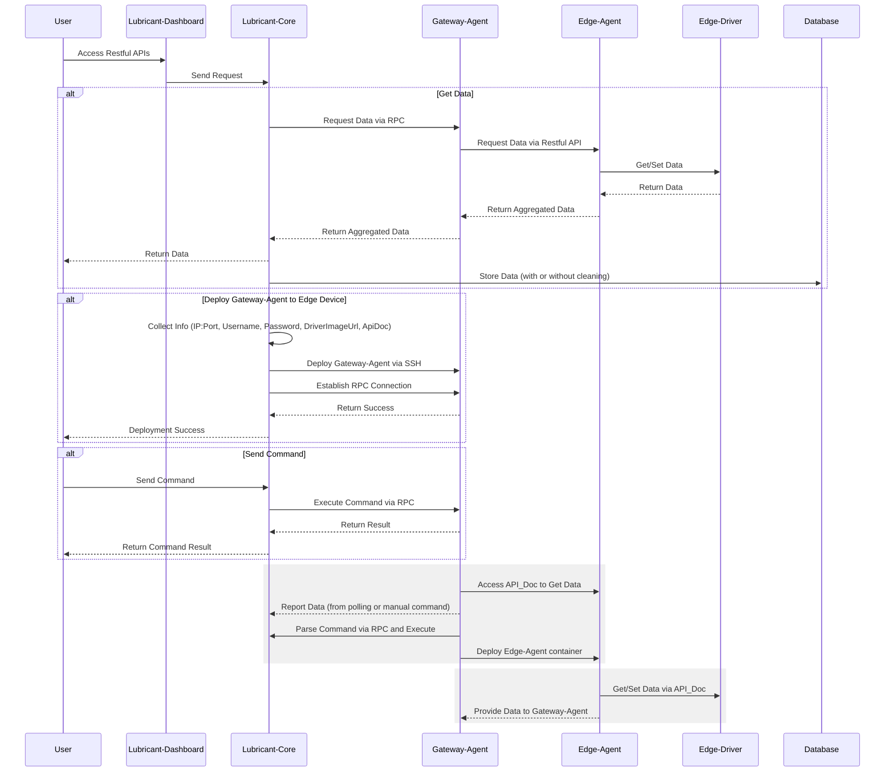

# Lubricant-Design

Lubricant润滑剂:让齿轮,轴承稳定连接,运转的功臣.

## Lubricant的设计目标:

针对于传统的物联网边缘节点数量巨大且分散,使得数据变得多而杂,
并且最终通过各种通信协议仅连接到极少数服务器,对于中心服务器的压力十分巨大.

对于此,本项目提供了不一样的解决方案:
边缘设备网关节点对数据汇总但不进行传输,仅在对数据需要访问的时候再传输,和在核心服务器低负载时传输
从而达到了更好地利用资源,节省资源的目的,对我们的资源起到了"润滑"的作用.

Lubricant提供以下3个组件,外加用户提供的一个通用驱动组件:

- Core:核心服务

1. 将Gateway-Agent汇总到的数据进行存储和分析,同时提供对外的接口供用户获取数据(包括实时数据,历史数据)
2. 负责通过IP:Port-SSH协议自动在边缘设备上部署Gateway-Agent(如果边缘设备支持)
3. 负责向Gateway-Agent下发指令,比如数据读取,数据读写,指令操作
4. 提供Web接口供外部系统调用

- Gateway-Agent:边缘网关代理

1. 这是运行在边缘设备(边缘Linux设备,比如工控机)上的数据处理网关,用于采集Edge-Agent的数据并进行短暂存取;
2. 用于接受,并处理来自Core的指令
3. Core主动发现:通过预先设置的Core信息,自动连接Core,并完成指定任务.

- Edge-Agent:边缘驱动代理

1. 是运行在容器中的服务,根据定时轮训或手动调用等方式获取Edge-Driver的数据,并可以发送指令到Edge-Agent.

- Edge-Driver:(由用户编写的边缘驱动程序)

1. 是运行在容器中的Python脚本/二进制应用程序,提供OpenApi接口供Edge-Agent调用,获取数据/发送数据到物联网传感器

- Edge-Device:(由用户手动安装维护的物联网传感器或设备)

1. 传感器/设备,运行在边缘设备上,通过Edge-Driver获取数据

## Lubricant的功能实现原理:

Users通过Lubricant-Dashboard或手动调用接口的方式访问Lubricant-Core提供的Restful-Apis,可以执行以下三个操作:

1. 获取数据:
   Lubricant-Core根据User的指令,如果是要获取实时数据,通过RPC调用的方式获取来自Lubricant-Gateway-Agent汇总的数据,
   Lubricant-Gateway-Agent则通过调用Lubricant-Edge-Agent的Restful接口汇总来自Edge-Driver的数据.
   在获取到数据后,如果没有数据清洗需求,则将最新汇总到的数据直接存入Database中,并返回数据给用户;
   如果有数据清洗需要,则执行数据清洗脚本清洗数据后再存储并返回给User.

2. 部署Gateway-Agent到边缘设备:
   Lubricant-Core根据User的指令,收集这些信息:`IP:Port,Username,Password,DriverImageUrl,ApiDoc`,执行任务部署过程,
   通过SSH协议登录到远程主机后,执行部署脚本,将Gateway-Agent服务部署到边缘设备中.在Lubricant-Gateway-Agent部署成功
   (成功与Lubricant-Gateway-Agent建立RPC连接后),将成功信息返回给User.

3.指令下发:
Lubricant-Core根据User的指令,通过RPC调用Lubricant-Gateway-Agent的函数,执行特定命令,并将执行结果返回给User.

Lubricant-Gateway-Agent的功能如下:
1. 获取数据并上报:
   当Gateway-Agent需要获取数据时(固定时间轮询和来自Lubricant-Core的数据采集指令),通过本机存储的Api_doc访问
   运行于容器中的Edge-Agent,获取数据.若是手动操作,则直接将数据返回给Lubricant-Core.如果是来自轮询的指令,则适时上报.

2. 解析指令:
   当通过RPC收到了Lubricant-Core的指令,会进行解析,并执行对应的操作,并将指令执行结果返回给User.

3. 容器部署和管理:
   1). 当需要部署Lubricant-Edge-Agent时,拉取Lubricant-Edge-Agent镜像部署到Docker中,并根据参数,初始化Lubricant-Edge-Agent,返回部署结果
   2). 主动管理Lubricant-Edge-Agent容器的生命周期

Lubricant-Edge-Agent的功能如下:
提供Restful接口供Lubricant-Gateway-Agent调用
并根据Lubricant-Gateway-Agent设置的ApiDoc访问 Edge-Driver 获取/设置数据的值

Edge-Driver:
一个提供了符合Lubricant-Gateway-Agent设置的ApiDoc-Restful接口,供Lubricant-Edge-Agent调用 获取/设置数据的值

数量关系:
一个Core可以绑定多个Gateway-Agent,一个Gateway-Agent可以绑定多个Edge-Agent,但是一个Edge-Agent只能绑定一个Edge-Driver

边缘消息队列:

Gateway与Edge-Agent之间通过高性能本地消息队列进行通信,以实现边缘设备与网关数据的同步和推送.