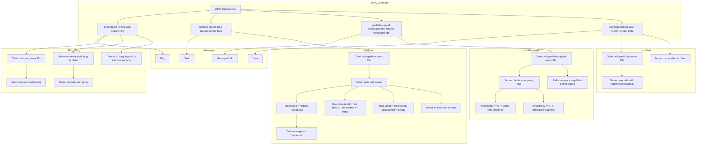

# gRPC Service Design:

Lubricant Core Backend Component `gRPC Service` Design

Core use gRPC as the communication protocol between the Gateway-Client, User-Client and the Core-Server.

**Note**:

1. All codes in the design document are considered as **pseudocodes** or codes that **cannot be used directly**
2. In the following, if there is no special reference, `Core` is considered as `Lubricant Core`

[TOC]

## Design goals:

1. Tls encryption support: gRPC support TLS encryption, and the certificate is generated by the Core itself or uploaded by the user
2. **Non-blocking** ,**Multi-threading** and **Asynchronous** processing of each task
   1. When the task is obtained, the response ID(NextID) of the task is **returned directly**
   2. Add tasks to the **task pool** for unified processing
   3. Use `goroutine`, `select` and `context` to process tasks in parallel
3. Support two services: `Gateway oriented` and `User oriented`.
4. All `Id` will be generated by the `uuid library`.
5. The ID of the response returned after each request is sent should be the same as when the request was sent. If not
   - If the ID is a valid UUID: it is considered that the request has not been processed and the pre ID has been returned. You need to query the task through MessageIdInfo or getTask
   - If the ID is an invalid UUID: the request is considered invalid

## Design none-goals:

None

## Gateway oriented Design:

### Data model:

```protobuf
syntax = "proto3";

service coreService {
  rpc ping(stream Ping) returns (stream Ping) {}
  rpc getTask(stream Task) returns (stream Task) {} // 服务端可能需要向客户端推送任务
  rpc pushMessageId(MessageIdInfo) returns (MessageIdInfo) {}
  rpc pushData(stream Data) returns (stream Data) {}
}

message Ping {
  int32 flag = 1; // 0:Ping 1:Pong 3: Error
}

message Task { // Resp
  string taskId = 1;
  string messageId = 2; // 如果服务端任务该消息需要处理,则会返回预响应的messageID;否则getTask req.messageId应该与返回的resp.messageId一致
  bytes content = 3; // json格式 []byte
}

message MessageIdInfo {
  string messageId = 1; // 如果服务端任务该消息需要处理,则会返回预响应的messageID;pushMessageId req.messageId应该与返回的resp.messageId一致
  string gatewayId = 2;
  string time = 3;
  string emergency = 4; // 0: 不需要立即回应 1: 需要立即回应(将直接返回resp的消息ID)
  bytes content = 5; // json格式 []byte 响应内容resp
}

message Data {
  string messageId = 1; //如果messageId不符合uuid,则认为是返回错误信息
  string gatewayId = 2;
  string agentID = 3; // agentID用于标记数据所属
  repeated bytes data = 4;    // 二进制数据字段
  int32 dataLen = 5;
  string time = 6; // 起始时间
  int32 cycle = 7; // 数据周期 s
}
```

### About `message`:

Ping: ping message for heartbeat

Task: The task that the Gateway-client sends to the Core, and get task from the Core

MessageIdInfo: The message ID information that tells the Core and Client how the message is

Data: The data that the Client sends to the Core / The task data that the Core sends to the Client


### About `service`:

ping: The Gateway-client sends a ping message to the Core, and the Core returns a pong message. The Core will send a ping message to the Gateway-client every 30 seconds.

getTask: The Gateway-client sends a getTask message to the Core, and the Core returns a task message. The Core will send a task message to the Gateway-client.
    - If additional data transmission is required, `Task.content` will be empty, `messageId` will be the `pre taskID`, and the server will push the `pre taskID` and `additional data` to the client through `pushData`

pushMessageId: The Gateway-client sends a messageID information message to the Core, and the Core returns a messageID information message. The Core will send a messageID information message to the Gateway-client.

pushData: The Gateway-client sends data to the Core, and the Core returns data. The Core will send data to the Gateway-client.


### Handel Processing Data:

1. Ping-Pong

   The client will call `ping` every 30s, and the server will return `pong`;

   The server will also randomly call `ping` to the client through two-way flow within 30~45s, and the client will return `pong`

   If no response is received (5s timeout), or Ping.flag==3 (Error), it is considered that the client has lost the connection with the server, and the client will try to connect with the server again

2. getTask

   When the client calls getTask every 30s to obtain tasks from the server, the server will poll the task queue of the client

   A. If there is no task, the response Task.taskId will be consistent with the request Task.taskId, and Task.messageId=Task.taskId

   B. If there is a task, the response Task.taskId will be the same as the request Task.taskId, and Task.messageId = the new taskId, Task.content will not be empty

   C. If the server is generating tasks for it, the response Task. taskId=new taskId, Task. messageId = new taskId, Task.content is empty; The client will use the new taskId as the taskId of the next call to getTask

   D. If the server successfully generates the task, it will directly push the task to the client through two-way flow, and the client will reset the getTask polling timer after receiving the task

3. pushMessageId

   The client will regularly call pushMessageId every 30s to push message ID information to the server, and the server will check the `emergency flag` after receiving it

   A. If emergency==0: The request will be blocked until the response succeeds or times out
   B. If emergency==1: This request will be responded immediately. The `emergency flag` will be the pre response messageID and the request will not block

   After receiving the resp, if the `emergency` is not empty, the client will add it to the getTask polling queue and reset the polling timer

   The server may also push message ID information to the client through pushMessageId

4. pushData

   The client will regularly call pushData every 30s to push data to the server. After the server receives it, the returned pushData.messageId will be consistent with the pushData.messageId at the time of the request

   The server may also push data to the client through pushData

Mermaid:



## User oriented Design:

Todo: 
