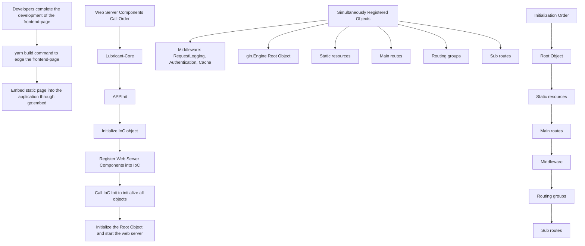

# Lubricant Core Backend Design
Lubricant Core Backend Component Function Design

**Note**: 

1. All codes in the design document are considered as **pseudocodes** or codes that **cannot be used directly**

[TOC]

## Web Server And APIs

- Lubricant-Core will use `go-gin` as web server and `gin-swagger` for API documentation.
- The Web Server Component named `ioc.WebServer` will be registered and managed by `IoC`.
- APIs will be divided into two parts: `Publicly available operational API interfaces` and `Publicly available generic interfaces`
  - The former will be used for `direct operations` on the Core, while the latter will be used to provide `static resources`
- Middleware will be added to the web server to handle common tasks such as request logging, authentication, cache, etc.


### Module Design:


### Library Dependencies:

- `go-gin` as web server
```go
import "github.com/gin-gonic/gin"
```
- `gin-swagger` for API documentation

### IoC hosting:

The Web Server Component will be registered and managed by `IoC`.

Including `root objects`, `static resources`, `main routes`, `routing groups`, `sub routes`, etc... All should be hosted by `IoC`

- Name: `ioc.WebServer`  
  ```go
  const APP_NAME_CORE_WEB_SERVER = "lubricant-core-web-server"
  
  const CoreWebServer = iota
  ```
- Weight: Any but higher than `ioc.DataStore`
  - `root objects`: Equivalent to ioc.WebServer.Weight
  - `static resources`: Equivalent or greater than ioc.WebServer.Weight
  - `main routes`: Any weight greater than ioc.WebServer.Weight
  - `routing groups`: Any weight greater than `main routes`
  - `sub routes`: Any weight greater than `routing groups`
- Naming rules:

For const string: `const APP_NAME_CORE_WEB_SERVER_<COMPONENT_NAME> = "lubricant-core-web-server_<component_name>"`

For Weight: `const CoreWebServer<component_name>`

### Middleware:

Only `Publicly available operational API interfaces` will be handled by middleware.

- Request Logging: Use `gin.Logger()` middleware to log all requests.
- Authentication: Use `pkg/middleware/auth` middleware to authenticate requests.
- Cache: Use `pkg/middleware/cache` middleware to cache responses.

### Embedded resources:
Use Golang `embed` feature to embed `static resources` into the binary.

Static resources' path: `frontend/dist`

Build frontend:
```shell
yarn install
yarn run build
```

Embed static resources to the binary:

```go
package main

import (
	"embed"
	"fmt"
	"net/http"

	"github.com/gin-gonic/gin"
)

//go:embed frontend/dist
var f embed.FS

func main() {
  r := gin.Default()
  st, _ := fs.Sub(f, "frontend/dist")
  r.StaticFS("/", http.FS(st))

  err := r.Run("0.0.0.0:5999")
  if err != nil {
    fmt.Println(err)
  }
}
```

### Test:

Ut and e2e test will be added to ensure the correctness of the API.

### API Documentation:

Todo: Need to be designed

- Unit test: 
  - Use `go test` to test the API.
- End-to-end test:
1. Get The Test authorization token
2. Send requests to the API

## gRPC Server

- gRPC server will be used to provide `remote procedure calls` between `Core` , `Gateway Client` and `User Client`.
- The gRPC server Component named `ioc.GRPCServer` will be registered and managed by `IoC`.
- The gRpc Server will provide `Gateway oriented` and `User oriented` services
- TLS(Optional) will be used for encryption, and mutual authentication is required

### Module Design:

### Library Dependencies:
- `protobuf` for message and service definition
    ```shell
      go install google.golang.org/protobuf/cmd/protoc-gen-go
      go install google.golang.org/grpc/cmd/protoc-gen-go-grpc
      go get google.golang.org/protobuf
    ```
- `grpc` for gRPC server
    ```shell
      go get google.golang.org/grpc
    ```
  
Build the protobuf files:

```shell
protoc -I=. --go_out=.   --go-grpc_out=. --go-grpc_opt=module= protobuf/core/data.proto
```


### IoC hosting:

The gRPC Server Component will be registered and managed by `IoC`.

Due to the design of gRPC, the complete logic of gRPC will be treated as a large object

The small objects under it are only `authorized` objects

- Name: `ioc.GRPCServer`
  ```go
  const APP_NAME_CORE_GRPC_SERVER = "lubricant-core-grpc-server"
  
  const CoreGrpcServer = iota
  ```
- Weight: Any but higher than `ioc.DataStore`
  - `Authorized objects`: Less than ioc.WebServer.Weight
- Naming rules:
  - `const APP_NAME_CORE_GRPC_SERVER_<SERVICE_NAME> = "lubricant-core-grpc-server_<service_name>"`
  - `const CoreGrpcServer<service_name>`

### Data Model:

**Gateway oriented:**
```protobuf
syntax = "proto3";

service coreService {
  rpc ping(stream Ping) returns (stream Ping) {}
  rpc getTask(stream Task) returns (stream Task) {}
  rpc pushMessageId(MessageIdInfo) returns (MessageIdInfo) {}
  rpc pushData(stream Data) returns (stream Data) {}
}

message Ping {
  int32 flag = 1;
}
message Task {
  string taskId = 1;
  string messageId = 2;
  bytes content = 3;
}

message MessageIdInfo {
  string messageId = 1;
  string gatewayId = 2;
  string time = 3;
  string emergency = 4;
  bytes content = 5;
}

message Data {
  string messageId = 1;
  string gatewayId = 2;
  string agentID = 3;
  repeated bytes data = 4;
  int32 dataLen = 5;
  string time = 6;
  int32 cycle = 7;
}
```

**User oriented:**

```protobuf
syntax = "proto3";

service userService {

}

message messageName{
  
}
```

### Test:

It is a bit difficult to test gRPC, but we should try our best to make the software robust

In terms of unit testing, use mockery to generate mock objects for gRPC server

In terms of end-to-end testing, we can use the `grpcurl` or other tool to send requests to the gRPC server and check the results.


## DataStore

DataStore is a component that stores data in a persistent way. 

As we all know, in the case of massive data, disk IO is an important factor restricting performance. Therefore, 
we should not frequently access disks, but speed up our requests through `Caching technology`
