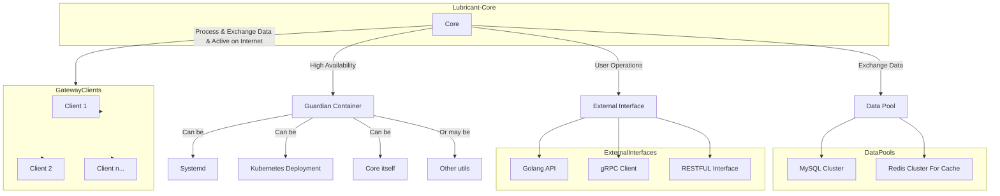

# Lubricant-Core-Design

Lubricant-Core 是IoT-Lubricant的核心应用,是管理整个Lubricant的大脑

​	本文是对Lubricant-Core进行详细说明，以便用户及项目开发人员了解产品详细的设计与实现。为开发人员提供开发参考书。以下叙述将结合文字描述、伪代码，图表等来描述Lubricant-Core的详细设计和相关的模块描述。本文告的预期读者有客户、项目经理、开发人员以及跟该项目相关的其他竞争人员。

[TOC]

## Core核心功能的设计目标:

Core将向用户提供一个前端页面用于直接管理用户的物联网设备集群,具体请看[Dashboard-Design](frontend-design.md) 本文将不对前端部分展开.

除了用于作为前端的Web服务器,它还将作为一个gRPC服务端用于获取Gateway<-Agent<-IoT-Devices上传上来的数据,并通过一定的技术手段使得用户可以远程的操作边缘节点网关,以及边缘节点上的GatewayApp

因而我们需要实现如下核心功能

1. Web服务端:用于统一处理来自外部(用户)的请求
   1. 可以对外提供的接口类型:RESTFUL, gRPC, GolangApi
2. gRPC服务端:作为RPC的主体,负责处理来自Gateway的数据和向Gateway发送指令
   1. 除了通过RPC,我们还可以通过将Core作为SSH客户端,在Gateway有公网的情况下远程连接至Gateway SSH-Server用于指令传输
3. dataStore客户端:我们将对采集上来的数据进行**清洗**,**转发**和**存储**
   1. 为了提升性能,应该尽可能的使用缓存技术

## Core非核心功能的设计目标:

1. **三高架构**:
   1. 虽然我们的核心任务是提供数据的存储及转发,但是作为整套物联网系统的数据处理中心,一个高可用,高性能,高扩展的架构设计是必须的
   2. **高可用**:除了由部署模式决定,我们还应该在业务代码层面,架构设计层面实现功能的高可用
   3. **高性能**:由于物联网系统的数据量十分庞大,在处理这些数据时我们需要对性能指标进行额外的关注,这将由核心算法和语言特性共同实现
   4. **高扩展**:由于用户采集的数据是自己的,有的时候并不一定能契合我们默认的模型,因此我们需要提供不错的扩展能力以便用户能将他们的数据轻松接入至我们的系统
2. **广泛兼容性**:支持多种部署模式:
   1. 为了适应各种极端环境,Lubricant应该提供不错的跨平台兼容性和部署能力
   2. 应该同时支持单体部署(单体高可用),容器化部署(适用于快速,批量部署),脚本自动化部署
3. **安全性**:
   1. **加密传输**: 采用Lubricant的物联网系统运行环境决定了数据将不一定是在内网中传输的,我们需要对在公网中的数据进行加密传输
   2. **安全的授权验证**:对所有敏感业务接口都应该进行绝对的安全验证
   3. **用户定义安全**:如果我们设计为了一套固定的安全标准,将有可能会被破译.因此,我们将安全的选择权交予用户,由用户手动决定安全的定义
4. **鲁棒性**:
   1. 我们需要对各种可能影响系统的故障和干扰的方面都要进行考虑

## 整体设计

Lubricant-Core作为一套中心系统,需要与多个组件或功能相连接,下文提到的4点都是它的连接目标
下文中的`Core`都将指`Lubricant-Core`

1. 守护者容器:
  Core需要一个守护者,用于实现高可用. 它可能是systemd,Kubernetes-Deployment,或者Core自身等
  Core应该是作为守护者容器下的子进程,被守护者容器所包含,监控和管理

2. 数据池: 
  包括MySQL集群与Redis集群,Core将与它们进行数据交换

3. Gateway客户端:
  Core将与一个或多个活跃在Internet上的Gateway客户端建立连接,处理和交换两方的数据

4. 对外接口
  包括GolangAPI,gRPC Client和RESTFUL接口,用于直接与用户的操作打交道

## Core的模块

| 模块名 | 编号 | 设计文档 | 所在包 |
| :----: | ---- | -------- | ------ |
|        |      |          |        |
|        |      |          |        |
|        |      |          |        |

